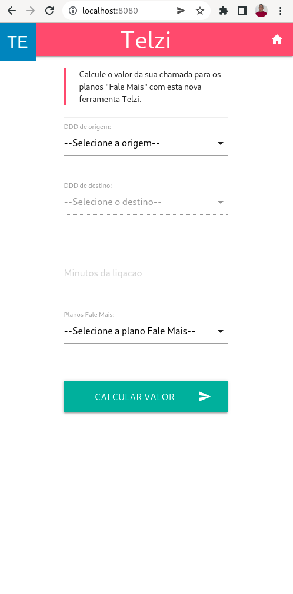
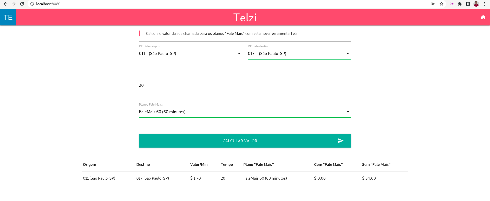
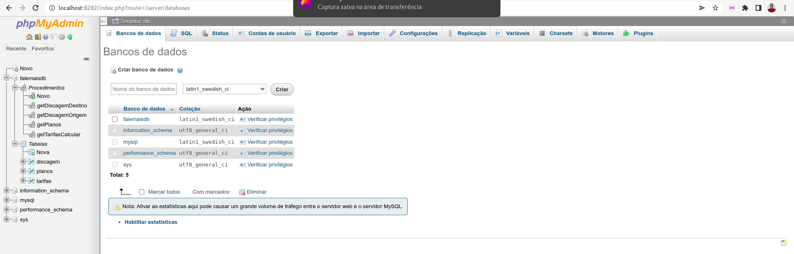

System "Fale Mais"
===========

This project uses docker and docker-compose

Follow the instructions to access the web system

### Requirements :
- Install Docker.
- Install Docker Compose.


### Enter the root of the project and execute any of the commands FaleMais/ :

Run (Recommended):
---

```
docker-compose up -d
```

or

```
docker-compose up
```

> Param `-d` runs container in background (detach)


### Web access

http://localhost:8080/

### phpMyAdmin access

http://localhost:8282/


### The database is already loaded in docker, but it is available in the path:

```
Docker/Database/falemaisdb.sql
```

### database internal access

```
Host internal: db
Port internal: 3306

Host external/remote: localhost
Port external/remote: 8181

User: user
Password: password
Database: falemaisdb

Root Password: root
```

Stop
----

```
docker-compose down
```

> To stop all containers AND kill all volumes `docker-compose down --volumes`

### References



